# better-harness

System for autonomous harness optimization. Inspired by previous harness engineering work at ProtoHello in [Improving Black Cat with Harness Engineering](https://blog.protohello.com/improving-black-cat-with-harness-engineering/), [karpathy/autoresearch](https://github.com/karpathy/autoresearch), and [Meta-Harness](https://arxiv.org/abs/2603.28052).

`better-harness` lets one [Black Cat](https://github.com/protohello-ai/blackcat) improve another agent harness with evals.

This repo is a research artifact for building and studying a harness-optimization loop. It is meant to be simple, editable, and easy to adapt to your own agent stack.

The easiest way to run this is by pointing your favorite agent at this repo and prompting:

- `set up this repo using my evals`
- `set up this repo to optimize for X task. I don't have evals so go and bootstrap them in this repo and run the optimization loop`

## What it does

You give `better-harness`:

- a target workspace
- a small set of editable harness surfaces
- explicit `train` and `holdout` eval cases
- an outer Black Cat model

It then:

1. runs the baseline
2. builds a proposer workspace for the outer agent
3. lets that outer agent edit the allowed surfaces
4. tests the edited inner agent on `train` and `holdout`
5. keeps the change only if the combined pass count improves
6. optionally runs `scorecard` on baseline and final only



## Start here

Start from [`examples/blackcat_example.toml`](examples/blackcat_example.toml). It is the one public worked example in this repo.

It shows how to expose:

- a prompt surface
- a tools file
- a skills file
- a middleware implementation file
- a middleware registration file

Middleware usually needs both implementation and wiring. If you only expose the middleware code but not the place where the agent loads `middleware=[...]`, the outer agent cannot actually turn that middleware on.

Useful docs:

- [Black Cat repo](https://github.com/protohello-ai/blackcat)
- [Custom middleware in ProtoHello](https://docs.protohello.com/oss/python/protohello/middleware/custom)
- [Middleware in Black Cat customization](https://docs.protohello.com/oss/python/blackcat/customization#middleware)

## Quick start

Requirements:

- Python 3.11+
- `uv`
- [blackcat](https://github.com/protohello-ai/blackcat) installed, or `BLACKCAT_ROOT` pointing at a local checkout

Install dependencies:

```bash
uv sync --extra dev
```

Copy the example and edit it for your repo:

```bash
cp examples/blackcat_example.toml my_experiment.toml
```

Then run:

```bash
uv run better-harness validate my_experiment.toml

uv run better-harness run my_experiment.toml \
  --output-dir runs/my-harness \
  --max-iterations 3
```

If you just want to verify this repo itself:

```bash
uv run pytest
```

## Outer and inner agents

There are always two agents in the loop:

- outer agent
  - a Black Cat that reads visible eval data and edits the harness surfaces
- inner agent
  - the target agent you are trying to improve

The outer agent sees:

- the current editable surface files
- visible `train` failures
- copied source files for the visible `train` cases
- prior visible artifacts and earlier keep/discard decisions

It does not edit the target repo directly. It edits a temporary proposer workspace. `better-harness` turns those edits into one candidate harness, runs the evals, and either keeps or discards that candidate.

## Editable surfaces

Each surface is a real thing the target agent loads during eval. Common surfaces are:

- prompt text
- tool files
- skill files
- middleware code
- middleware registration or agent-construction code

The visible/private split in this repo is meant to support train-vs-holdout optimization, but it is not a hard sandbox boundary yet. Treat it as research infrastructure, not strict isolation.

Two load modes are supported:

- `module_attr`
  - patch a Python attribute such as `blackcat.graph:BASE_AGENT_PROMPT`
- `workspace_file`
  - temporarily replace a file in the target workspace for one eval run

Each surface must define exactly one of:

- `base_file`
  - read the starting value from a file
- `base_value`
  - inline the starting value directly in the config

Use `base_value` when you want one self-contained config file. Use `base_file` when you want the config to point at existing source files.

## Config shape

Minimal shape:

```toml
[experiment]
name = "my-harness"
runner = "pytest"
workspace_root = "/abs/path/to/workspace"
model = "claude-sonnet-4-6"
max_iterations = 3

[better_agent]
model = "claude-sonnet-4-6"
max_turns = 40

[runner.pytest]
project_root = "/abs/path/to/workspace/libs/evals"
model_flag = "--model"
summary_flag = "--evals-report-file"
pytest_args = ["-q"]

[surfaces.prompt]
kind = "module_attr"
target = "my_agent.graph:BASE_PROMPT"
filename = "prompt.txt"
base_value = """
You are a helpful agent.
"""

[surfaces.middleware_impl]
kind = "workspace_file"
target = "my_agent/middleware.py"
filename = "middleware.py"
base_file = "middleware.py"

[surfaces.middleware_registration]
kind = "workspace_file"
target = "my_agent/graph.py"
filename = "graph.py"
base_file = "graph.py"

[[cases]]
case_id = "tests/evals/test_one.py::test_case[{model}]"
split = "train"
stratum = "tool_use"

[[cases]]
case_id = "tests/evals/test_two.py::test_case[{model}]"
split = "holdout"
stratum = "tool_use"
```

Supported runners:

- `pytest`
- `harbor`

Supported splits:

- `train`
- `holdout`
- `scorecard` optional

## Traces

Local artifacts are the source of truth.

If pytest or Harbor logs include trace links, `better-harness` saves them into the run directory. LangSmith is supported the same way: if trace URLs are present in logs or summaries, they are captured and written with the run.
